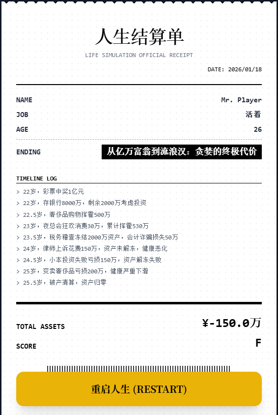

# BreakingRich - 富豪欲望都市模拟器

> **版本**: V7.1 | **类别**: 网页文字冒险游戏 | **状态**: 可玩

## 🎮 项目概述

**预览（游戏内截图）**



**BreakingRich** 是一款基于DeepSeek AI驱动的富豪人生模拟文字冒险游戏。玩家从一个中奖1亿元的天降横财开始，在欲望与理性的抉择中体验富豪人生的起起落落。

### 核心特色
- 🤖 **AI驱动剧情**: 基于DeepSeek/OpenAI API的智能剧情生成
- 💰 **真实财富模拟**: 涵盖房地产、奢侈品、投资、消费等真实经济活动
- 🌪️ **动态事件系统**: 包含金融风暴、健康危机、税务稽查等突发事件
- 🏆 **成就徽章系统**: 解锁不同人生阶段的里程碑成就
- 📱 **响应式设计**: 完美适配桌面和移动端浏览器

## 🚀 快速开始

### 本地运行
```bash
# 克隆项目
git clone <repository-url>
cd BreakingRich

# 直接打开index.html文件
open index.html
# 或使用本地服务器
python -m http.server 8000
```

### 在线访问
将项目部署到任意静态网页托管服务（GitHub Pages、Vercel等）即可在线访问。

## ⚙️ 配置说明

### API配置
游戏需要配置DeepSeek API Key：
```javascript
API Key: sk-xxxxxxxxxxxxxxxxxxxxxxxxxxxxxxxx
API Base URL: https://api.deepseek.com/v1
```

### 游戏初始化
- **性别选择**: 男性/女性（影响选项偏好）
- **初始职业**: 自定义职业背景
- **初始资产**: 1亿元彩票奖金

## 🎯 游戏玩法

### 核心机制
1. **选择驱动**: 每个回合提供3-4个选项决定人生走向
2. **属性管理**: 金钱、快乐、健康、名声四种属性平衡
3. **时间推进**: 年龄增长触发不同人生阶段事件
4. **随机事件**: 20%概率触发突发事件改变命运

### 结局类型
- **A级结局**: 理性投资，善终人生
- **B级结局**: 均衡发展，平淡收场  
- **C级结局**: 纵欲过度，悲剧收场
- **D级结局**: 破产负债，人生崩盘

## 📁 项目结构

```
BreakingRich/
├── index.html          # 主游戏界面
├── pic1.jpg           # 项目截图1
├── pic_final.png      # 项目截图2
└── README.md          # 项目说明文档
```

## 🏗️ 技术架构

### 前端技术
- **HTML5**: 语义化结构
- **CSS3**: Tailwind CSS + 自定义动画
- **JavaScript**: ES6+ 原生JS，无第三方依赖

### AI集成
- **API**: DeepSeek Chat Completion API
- **Prompt工程**: 结构化指令确保数值准确性
- **错误处理**: 完善的网络异常处理机制

## 🎨 界面特色

### 视觉设计
- **黑暗主题**: 深色背景配合金色强调色
- **拟物化元素**: 复古打字机风格文字效果
- **流畅动画**: CSS3过渡动画增强交互体验
- **响应式布局**: 自适应不同屏幕尺寸

### 交互功能
- **实时属性显示**: 顶部状态栏监控关键指标
- **成就徽章**: 个人资料页面展示里程碑
- **结算小票**: 游戏结束时的复古风格总结
- **浮动数值**: 关键变化的视觉反馈

## 🔧 自定义开发

### 扩展事件库
在`GLOBAL_EVENTS`数组中添加新的事件类型：
```javascript
const GLOBAL_EVENTS = [
    { id: "new_event", text: "事件描述文本..." }
];
```

### 修改数值系统
调整`applyDiff`函数中的属性计算逻辑：
```javascript
function applyDiff(diff) {
    // 自定义数值变化规则
}
```

## 🐛 故障排除

### 常见问题
1. **API连接失败**: 检查API Key和网络连接
2. **数值显示异常**: 刷新页面重新开始游戏
3. **选项不显示**: 检查浏览器控制台错误信息

### 调试模式
打开浏览器开发者工具查看详细的API请求和响应日志。

## 📊 游戏数据

### 初始属性
- **金钱**: 100,000,000元
- **快乐**: 80点
- **健康**: 90点  
- **名声**: 50点
- **年龄**: 22岁

### 关键阈值
- **破产**: 负债超过500万元
- **健康崩溃**: 健康值降至0
- **年龄上限**: 自然生命结束

## 🤝 贡献指南

欢迎提交Issue和Pull Request来改进游戏：
- 新增事件剧本
- 优化UI/UX设计
- 完善数值平衡
- 本地化翻译

## 📄 许可证

本项目仅供学习和娱乐用途。请遵守相关AI服务的使用条款。

## 🙏 致谢

- **DeepSeek**: 提供强大的AI对话能力
- **Tailwind CSS**: 优秀的CSS框架
- **DiceBear**: 头像生成服务
- **Gemini3 pro**: 代码生成
- **GPT5**: 文案建议
---

**体验富豪人生，探寻人性边界。谨慎选择，你的每一个决定都将书写不同的命运篇章。**